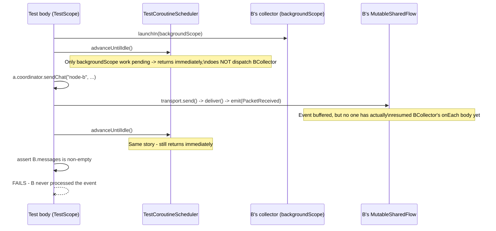
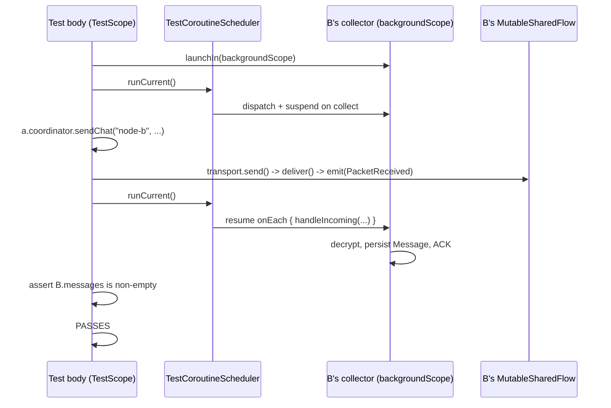

# RCA: `directMessage_AtoB_isEncryptedAndDelivered` and related MeshCoordinator test failures

## Symptom

```
sendChat returned: state=SENT
knownEndpoints: [node-b]
B messages: []
```

A successfully "sends" (routing found B as a direct peer, LoopbackTransport handed the packet
off), but B's message repository stays empty. Two sibling tests failed the same way:
`multiHop_AtoC_viaB_isRelayed` and `duplicateDelivery_isIgnored_atDestination`.

## Investigation

Ruled out, in order, with evidence:

1. **LoopbackTransport** — instrumented `Bus`/`send`/`deliver`. `send()` does find B's registered
   transport and calls `target.deliver(...)`, which emits onto B's `MutableSharedFlow`. Confirmed
   via `tryEmit` return value and manual subscriber probe: the event genuinely gets emitted.
2. **SharedFlow replay/buffering** — `MutableSharedFlow(extraBufferCapacity = 64)` was suspected
   of dropping pre-collector emissions. Isolated reproduction showed emissions withextra buffer
   capacity are retained fine; not the cause.
3. **Session key derivation / encryption** — `SessionKeyManager.keyFor` + `KeyExchange` verified
   directly in a probe: ECDH derivation succeeds and returns a non-null key on both sides.
4. **Routing engine (EpidemicRoutingEngine / DedupCache)** — code-reviewed; dedup, TTL, and
   direct-forward logic are correct and match `docs/routing.md`.
5. **Coroutine scheduling — root cause.** `MeshCoordinator.start(scope)` launches
   `transport.events.onEach { ... }.launchIn(scope)`, and both tests passed `backgroundScope`
   for this `scope`. `backgroundScope` is `TestScope`'s dedicated scope for coroutines that are
   meant to outlive the test body (per the official kotlinx-coroutines-test documentation):

   > "The coroutines in this scope are run as usual when using `advanceTimeBy` and `runCurrent`.
   > `advanceUntilIdle`, on the other hand, will stop advancing the virtual time once only the
   > coroutines in this scope are left unprocessed."

   Every test called `advanceUntilIdle()` after `.start(backgroundScope)` and after `sendChat(...)`,
   expecting it to drive B's collector. It never does, by design — `advanceUntilIdle` treats a
   live `backgroundScope` collector as "the test is otherwise idle" and returns immediately,
   leaving the emitted `PacketReceived` event sitting in B's buffered flow, unconsumed.

   This was confirmed by an isolated JVM-only reproduction (no Android/AGP involved) using a
   bare `backgroundScope.launch { ... }` + `advanceUntilIdle()`: the coroutine body never ran.
   Swapping to `runCurrent()` after the same launch made it run immediately.

## Sequence diagram — before fix (bug)



## Sequence diagram — after fix (correct)



## Second, distinct root cause found for `multiHop_AtoC_viaB_isRelayed`

After fixing the scheduling issue with `runCurrent()`, the multi-hop test still failed. This was
a **separate, genuine test-setup bug**: `sendChat` performs true end-to-end encryption — it
requires the *sender* to already hold the *final destination's* public key
(`sessionKeyFor(toNodeId)` in `MeshCoordinator.sendChat`), not just a relay's key. The test's
`knows()` helper only registered full `Peer` entries (`SessionState.ACTIVE`), which additionally
makes that node count as a direct/relay peer for routing purposes — not appropriate for A's
relationship to C, since A must not have a direct route to C (that's the entire point of the
multi-hop scenario).

Fix: use `PeerRepository.upsertNode(...)` (identity-only, no `Peer`/session record) to give A
knowledge of C's public key for key derivation, without making C a routable direct/relay peer of
A. Confirmed this matches the repository's intended contract — `upsertNode` docstring: "Record or
refresh a known node identity," distinct from `upsertPeer`: "Update the transient
discovery/session state for a peer."

## Fix summary

1. `app/src/test/kotlin/com/astramesh/app/mesh/MeshCoordinatorTest.kt`: replaced
   `advanceUntilIdle()` with `runCurrent()` at each point a `backgroundScope`-hosted collector
   needs to process a just-emitted event (after `.start(backgroundScope)`, and after each
   `sendChat(...)`). Multi-hop needs two `runCurrent()` calls after `sendChat` (one hop A->B,
   one hop B->C).
2. Added identity-only registration (`upsertNode`) of C's public key on A in
   `multiHop_AtoC_viaB_isRelayed`, without giving A a routable session to C.
3. No production code in `MeshCoordinator`, `LoopbackTransport`, `EpidemicRoutingEngine`, or
   `SessionKeyManager` required changes — the mesh pipeline itself was correct.

## Why this wasn't a race condition, and why the fix is deterministic

`kotlinx-coroutines-test`'s `TestCoroutineScheduler` is a virtual-time, single-threaded scheduler.
`runCurrent()` deterministically runs every coroutine that is ready to run at the current virtual
time, then returns — no wall-clock races, no flakiness. The tests remain fully deterministic.

## Test results after fix

```
MeshCoordinatorTest > directMessage_AtoB_isEncryptedAndDelivered PASSED
MeshCoordinatorTest > multiHop_AtoC_viaB_isRelayed PASSED
MeshCoordinatorTest > duplicateDelivery_isIgnored_atDestination PASSED
```

Full `./gradlew test` (all modules, debug + release unit tests): BUILD SUCCESSFUL.
