# AstraMesh Architecture

## 1. Scope

AstraMesh is a **phone-first offline mesh communication system** with optional desktop/PC support for demos, monitoring, relay, and message viewing.

The MVP is designed so that **Android phones can communicate directly with other phones without internet, cellular data, or a central server**. PC support is kept as an optional companion node and demo surface, not a dependency for core messaging.

---

## 2. Product Principle

The system must work end to end with these rules:

- phone-to-phone is the primary path
- Bluetooth Low Energy is the primary discovery and transport layer
- messages are encrypted before leaving the sender
- messages are stored locally before and after relay
- the network keeps working even if some nodes disconnect
- PC support is optional and should not block the mobile MVP
- every feature must compile cleanly from scratch

---

## 3. High-Level System Architecture

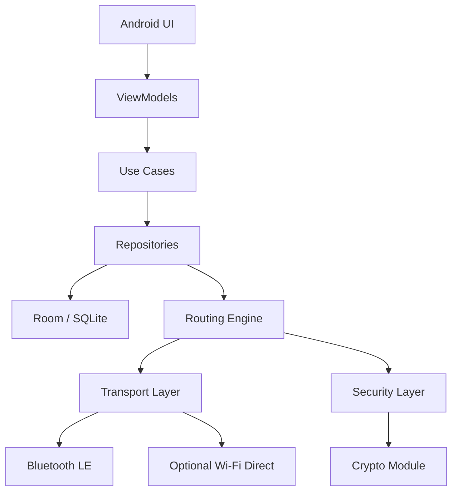

### Layer responsibilities

#### UI Layer
- Compose screens
- shows nearby peers, chats, files, broadcasts, and delivery state
- never talks directly to Bluetooth APIs

#### ViewModel Layer
- owns UI state
- calls use cases
- converts domain state into screen state

#### Use Case Layer
- sends messages
- discovers peers
- relays packets
- handles file sharing
- handles emergency broadcast

#### Repository Layer
- coordinates transport, persistence, routing, and security
- exposes clean APIs to the app

#### Routing Layer
- decides whether a packet goes directly, via relay, or into a retry queue

#### Transport Layer
- handles Bluetooth LE and optional local fallback transport

#### Security Layer
- encrypts and decrypts packets
- manages keys and signatures

#### Persistence Layer
- stores peers, packets, acknowledgments, files, and logs locally

---

## 4. Platform Strategy

### Primary platform
- Android phones

### Secondary platform
- PCs / laptops as optional relay or monitoring nodes

### Why phone-first
- hackathon demo is easier
- Bluetooth behavior is more realistic
- users expect mobile-based disaster communication
- PC support can be added without affecting the core protocol

### Why PC support still matters
- can show received messages on a larger screen
- can act as a relay hub
- can hold more cached packets
- can act as a local command / monitoring node

---

## 5. Technology Stack

### Mobile app
- Kotlin
- Jetpack Compose
- Material 3
- Coroutines
- Flow
- Hilt
- Room
- Kotlin Serialization

### Networking
- Bluetooth LE advertisements
- Bluetooth GATT
- optional Wi-Fi Direct fallback
- optional local desktop relay transport

### Security
- authenticated encryption
- public key exchange
- session keys
- packet signatures where required

### Storage
- Room on Android
- SQLite-compatible local persistence everywhere else

### Build and CI
- Gradle
- GitHub Actions
- APK artifact generation
- tests on every push

### Optional desktop companion
- Kotlin/JVM desktop or similar lightweight companion module
- receives relayed packets
- shows message dashboard
- acts as an optional relay/observer node

---

## 6. Repository Architecture

```text
AstraMesh/
├─ app/
├─ core-domain/
├─ core-protocol/
├─ core-routing/
├─ core-security/
├─ core-transport/
├─ core-persistence/
├─ core-mesh/
├─ core-ui/
├─ feature-discovery/
├─ feature-chat/
├─ feature-files/
├─ feature-broadcast/
├─ feature-settings/
├─ desktop/
├─ web/
├─ docs/
└─ .github/workflows/
```

### Module goals

- `core-domain`: entities, use cases, business rules
- `core-protocol`: packet models and serialization
- `core-routing`: relay logic and delivery algorithms
- `core-security`: key management and encryption
- `core-transport`: Bluetooth and transport abstraction
- `core-persistence`: local storage and queues
- `core-mesh`: `MeshCoordinator` + `SessionKeyManager` — the send/receive pipeline that wires
  transport, routing, security, and persistence together (§14), DI'd via Hilt so any feature
  module can inject it directly instead of talking to those layers individually
- `core-ui`: shared black-monochrome design tokens (color, spacing, radius) and reusable
  Compose components (message bubbles, delivery chips) so feature modules stay visually
  consistent without duplicating theme code (docs/design.md §5, §10)
- `feature-*`: UI features
- `desktop`: optional PC node and dashboard
- `web`: promotional site
- `docs`: design documentation
- `.github/workflows`: CI/CD

---

## 6.1 Module Dependency Graph

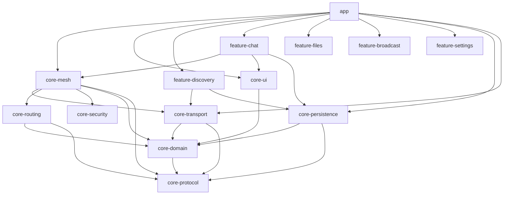

Pure-Kotlin modules (`core-domain`, `core-protocol`, `core-routing`, `core-security`) have no
Android dependency and are JVM-unit-testable in isolation. `core-mesh` and `core-persistence`
are Android libraries (Hilt-backed) but contain no UI. `core-ui` is Compose-only with no
transport/persistence knowledge — it is a pure design-system module.

## 7. Network Model

AstraMesh is not a client-server app. It is a peer-to-peer, multi-hop, local-first mesh.

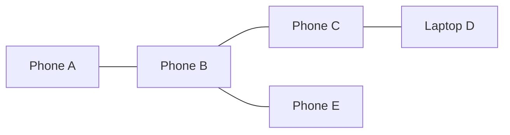

### Node roles
Every node may act as:
- sender
- receiver
- relay
- storage node
- presence beacon
- optional desktop observer

### Core idea
The app should behave like a small distributed system where every device can help carry messages.

---

## 8. Discovery Architecture

### Discovery goals
- find nearby devices
- identify app version and protocol compatibility
- exchange node capabilities
- establish a session path

### Primary discovery mechanism
- Bluetooth Low Energy advertisements

### Optional discovery mechanisms
- Bluetooth GATT service discovery
- Wi-Fi Direct discovery
- local desktop relay discovery

### Discovery flow

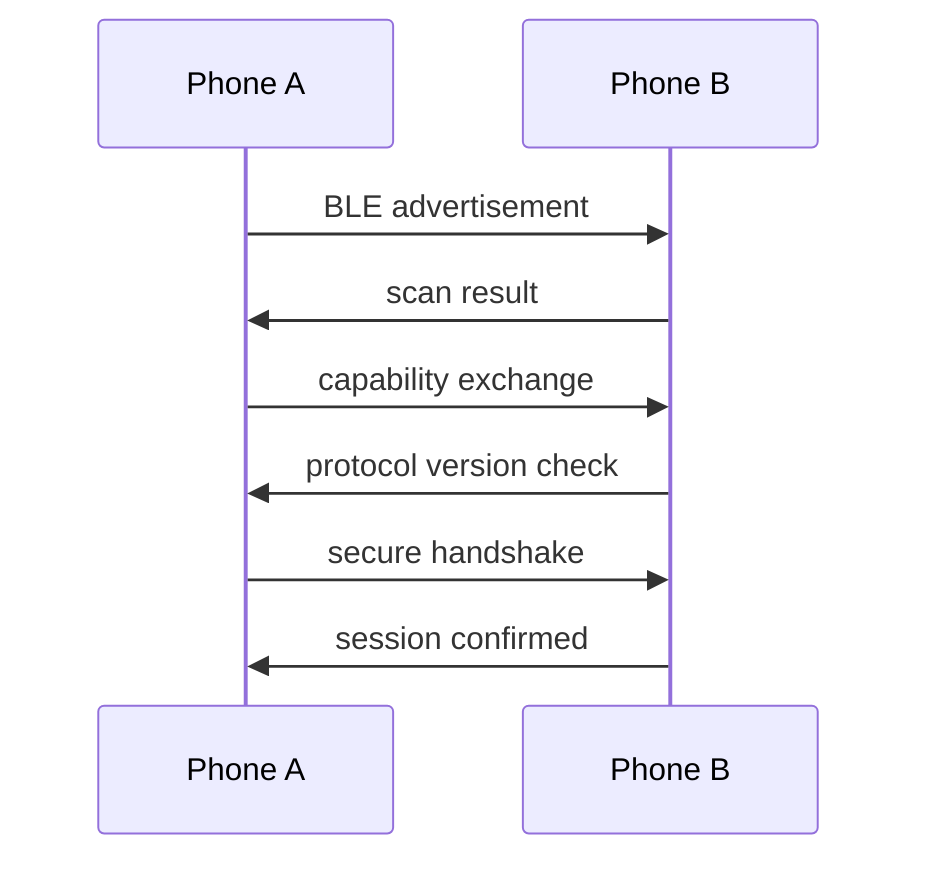

### Discovery data
- nodeId
- deviceName
- platform
- protocolVersion
- capability list
- relay support flag
- public key fingerprint

---

## 9. Transport Architecture

The transport layer must be abstracted so the app can switch between BLE and optional local fallback without changing routing logic.

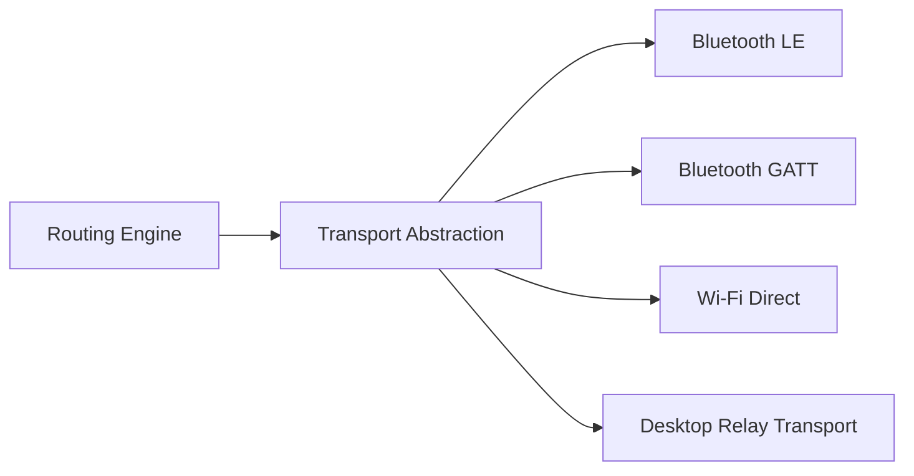

### Transport responsibilities
- connect to peer
- fragment packets if needed
- transmit packet chunks
- receive acknowledgments
- reconnect after interruption
- report health and signal status

### Transport constraints
- BLE is the default
- background behavior depends on platform restrictions
- packet sizes must remain conservative
- relays must tolerate disconnections

---

## 10. Packet and Protocol Architecture

### Packet types
- presence
- handshake
- chat
- broadcast
- file chunk
- acknowledgment
- routing summary
- health

### Packet envelope

```json
{
  "packetId": "uuid",
  "type": "chat",
  "senderId": "node-a",
  "receiverId": "node-b",
  "timestamp": 1234567890,
  "ttl": 10,
  "hopCount": 0,
  "version": "1.0",
  "payload": "encrypted-data",
  "signature": "optional",
  "checksum": "optional"
}
```

### Packet rules
- every packet has a unique ID
- every packet has a TTL
- every packet is encrypted
- every packet can be stored locally
- every packet can be relayed
- duplicate packets must be dropped

---

## 11. Routing Architecture

### Routing goal
Move packets to the best available next hop and preserve them until delivery or expiry.

### MVP routing model
- epidemic relay
- deduplication
- ACK-based tracking
- store-and-forward
- retry queue
- TTL expiration

### Routing flow

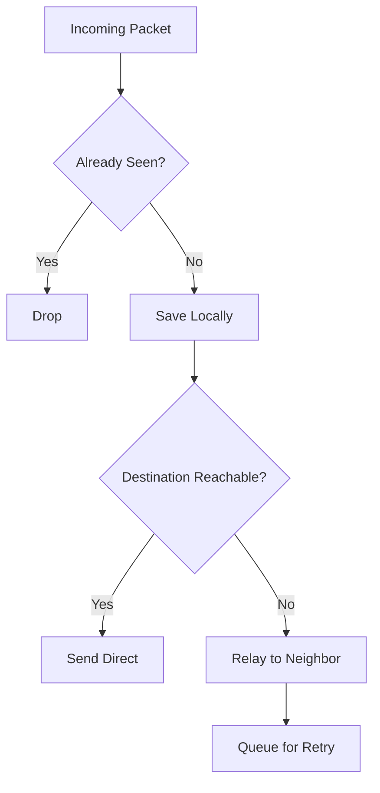

### Relay decision inputs
- peer proximity
- peer reliability
- capability support
- current queue size
- message priority
- remaining TTL

### Priority ordering
1. emergency broadcasts
2. direct chat
3. file chunks
4. background sync

---

## 12. Security Architecture

### Security goals
- no plaintext messages on the wire
- no server-side message storage
- no mandatory login
- local key storage
- replay protection
- packet integrity

### Security flow

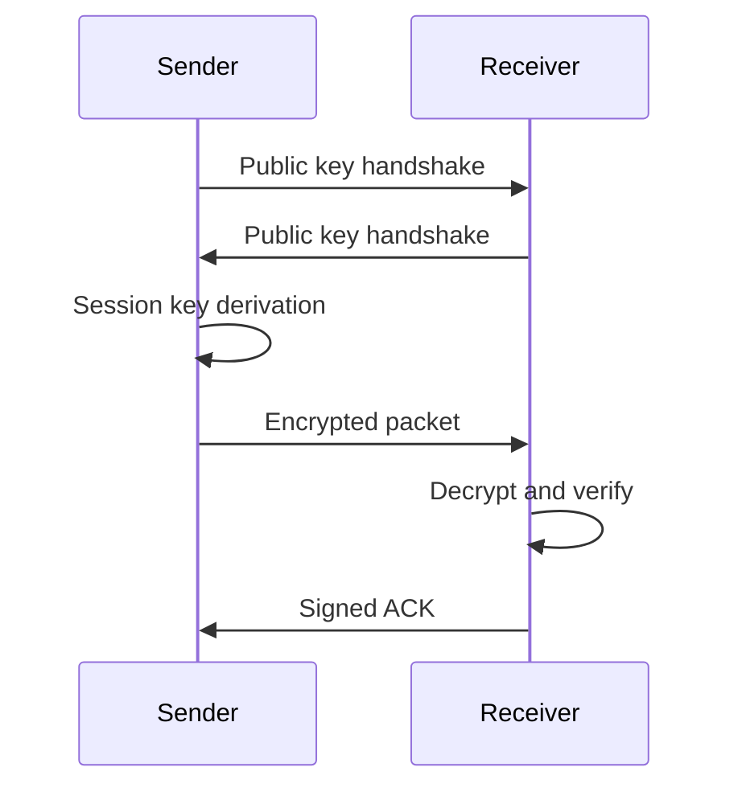

### Security rules
- encrypt before send
- decrypt after receive
- persist encrypted metadata when possible
- do not rely on a central auth server

---

## 13. Persistence Architecture

### Stored data
- peers
- sessions
- queued packets
- delivered packets
- failed packets
- ACK state
- file metadata
- broadcast history
- diagnostics

### Storage flow

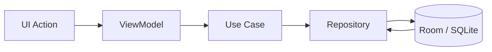

### Persistence rules
- save before send
- save on receipt
- keep retry state locally
- keep delivery status locally
- remove stale packets by policy

---

## 14. Chat Architecture

### Chat workflow
1. user types message
2. message is stored as pending
3. message is encrypted
4. routing engine chooses a path
5. transport layer sends it
6. receiver decrypts it
7. receiver stores it locally
8. ACK returns
9. UI updates delivery state

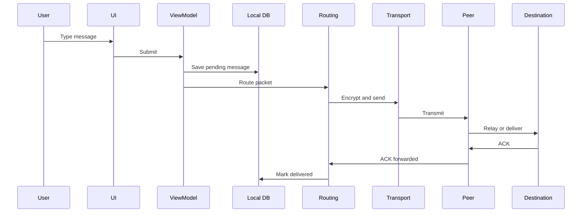

---

## 15. File Sharing Architecture

### File workflow
1. select file
2. create metadata entry
3. split file into chunks
4. encrypt chunks
5. send chunks through mesh
6. reassemble on receiver
7. verify integrity
8. update UI

### File pipeline

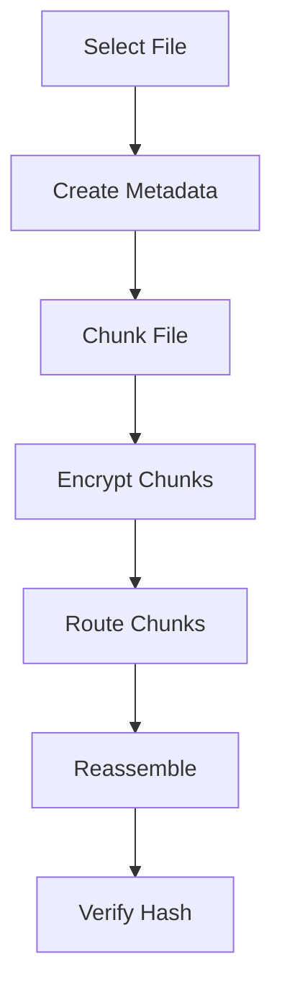

### Supported for MVP
- images
- text
- PDFs
- small documents

---

## 16. Emergency Broadcast Architecture

Broadcast should be high priority and visually distinct.

### Behavior
- send to all nearby nodes
- relay aggressively
- deduplicate globally by packet ID
- keep visible broadcast history
- preserve locally for later review

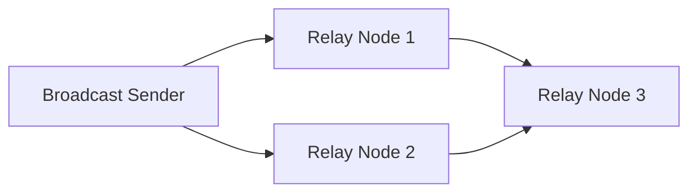

---

## 17. PC / Desktop Support Architecture

Desktop support is optional but useful for showing received messages, acting as a relay hub, and demonstrating stronger node behavior.

### Desktop roles
- message viewer
- relay node
- local archive
- diagnostics screen
- community station

### Desktop workflow
- start companion app
- discover phone peers
- receive packets
- show incoming messages
- relay messages further if needed
- act as demo dashboard

### Desktop in the demo
A laptop can receive messages from phones and show:
- message list
- delivery status
- relay count
- peer health
- file transfer state

This makes the architecture easier to present in a hackathon demo.

---

## 18. Demo Architecture

### Demo should show
- nearby discovery
- direct message
- multi-hop relay
- offline pending delivery
- file sharing
- emergency broadcast
- optionally desktop message view

### Demo setup
- two or three Android devices
- one optional laptop node
- Bluetooth enabled
- app opened on all devices
- internet disabled for the demo

### Demo sequence
1. show peers appearing
2. send message from phone A to phone C through phone B
3. show message landing on laptop if it is part of the mesh
4. disconnect one node and show store-and-forward
5. send a broadcast
6. send a file chunk
7. show encryption and local storage in the UI

---

## 19. Promotional Website Architecture

The promotional website should live in a separate folder so it does not mix with the app logic.

### Suggested folder
```text
web/
```

### Website purpose
- explain the project
- show product screenshots
- explain architecture at a high level
- present the hackathon pitch
- show call-to-action and demo video

### Website stack
- Next.js or React
- Tailwind CSS
- minimal monochrome branding
- static deployment on GitHub Pages, Vercel, or Netlify

### Website workflow
- homepage
- feature sections
- architecture summary
- demo section
- screenshots section
- contact / pitch section

---

## 20. Build and CI Architecture

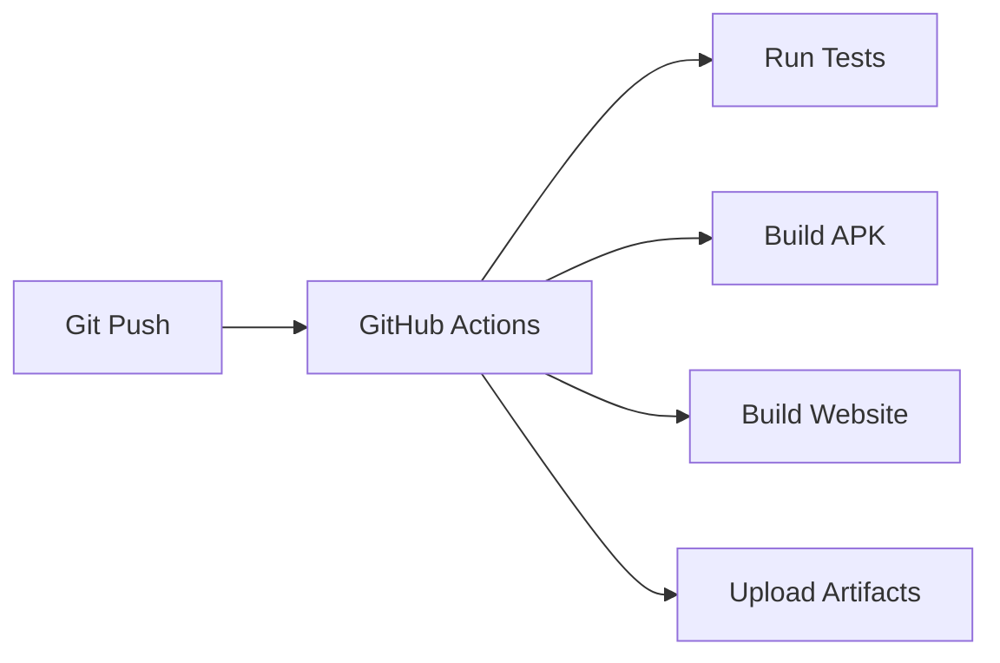

### CI responsibilities
- run unit tests
- run static checks
- assemble Android debug APK
- optionally build desktop artifacts
- optionally build website
- upload outputs as artifacts

---

## 21. End-to-End Success Criteria

The architecture is correct only if the following are true:

- phone-to-phone works without internet
- messages can hop through relays
- messages are encrypted
- messages are stored locally
- files can be shared in chunks
- broadcasts can reach multiple peers
- desktop can optionally display or relay messages
- website can present the project independently
- CI can build everything from scratch

---

## 21.1 Milestone 2 Implementation Notes

The end-to-end messaging demo (Chat UI Phase 4, Milestone 2) implemented the previously-designed
handshake and ACK flows described in §12 and §14:

- **Handshake**: `MeshCoordinator.connectTo(nodeId)` sends a `HANDSHAKE` packet (HELLO) carrying
  this node's public key; the receiver replies with its own handshake (HELLO_ACK) and both
  sides mark the session `SessionState.ACTIVE`. This is explicit (triggered by opening a chat
  thread or picking a peer), not automatic on radio discovery — radio-level "I can hear this
  device" and mesh-level "I have a session with this device" are deliberately kept distinct so
  the routing graph reflects real reachability policy, not raw signal range.
- **ACK**: delivering a `CHAT` packet locally now triggers an encrypted `ACK` packet back to the
  sender; the sender transitions `SENT -> DELIVERED` only once that ACK is received and
  decrypted, not merely once the local send call returns.
- **Store-and-forward**: a new `core-domain` interface `RelayQueueRepository` (Room-backed in
  `core-persistence` as `RoomRelayQueueRepository`, table `relay_queue`) holds packets a node is
  relaying for others but has no current route for — still encrypted, since a relay never
  decrypts. `MeshCoordinator.retryRelayQueue()` / `retryPendingMessages()` drain both this queue
  and the sender's own pending messages whenever a peer becomes reachable again. See
  [`docs/store-forward-flow.md`](store-forward-flow.md) and
  [`docs/demo-relay-flow.md`](demo-relay-flow.md) for full sequence diagrams.
- **Diagnostics**: `core-mesh`'s `PacketCounters` (chat/ACK/handshake/relay counts) and
  `RoutingEngine.dedupCacheSize` are surfaced in a new Settings → Diagnostics screen
  (`feature-settings`), alongside the live peer/route table.

## 22. One-Line Summary

AstraMesh is a phone-first offline mesh network where Android devices discover each other, exchange encrypted packets, relay messages hop by hop, store data locally, and optionally surface the same network state on a desktop companion and promotional website.
