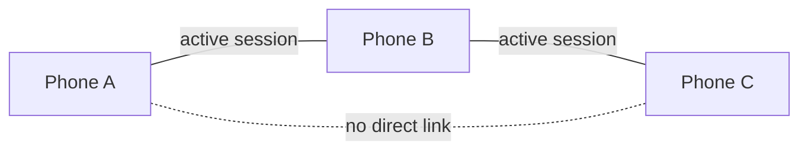
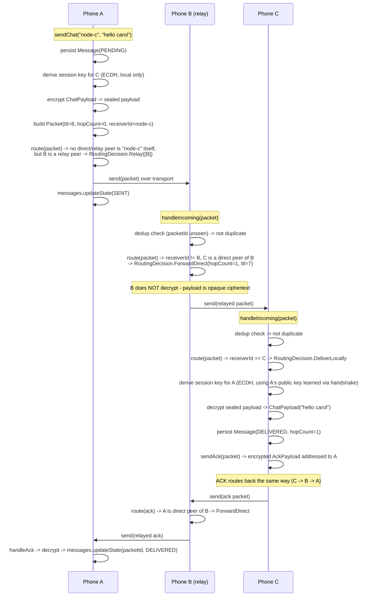
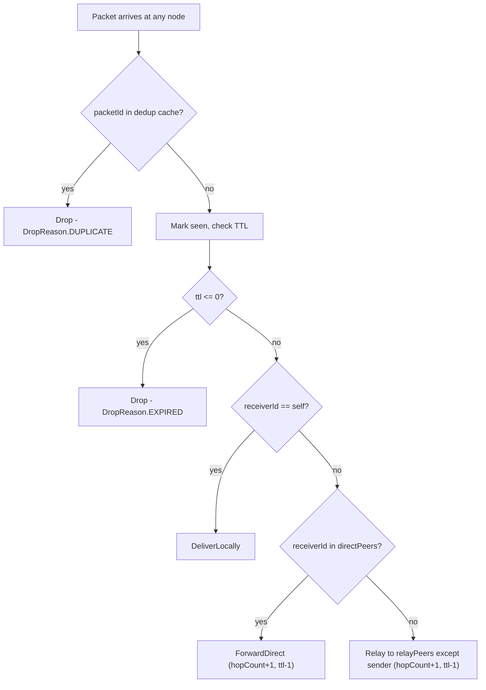

# Demo: Multi-Hop Relay (Phone A → Phone B → Phone C)

Companion to [`workflow.md`](workflow.md) §8 and [`routing.md`](routing.md). This document
walks through the exact sequence AstraMesh executes when A and C have no direct link and B is
the only relay, and points at the tests that verify each step
(`MeshCoordinatorTest.multiHop_AtoC_viaB_isRelayed`,
`MeshCoordinatorTest.relayNode_cannotDecryptPayload_itOnlyForwardsOpaqueBytes`).

## 1. Topology

A's only active session is with B. B has active sessions with both A and C. A has no session
with C at all — it doesn't even know C is nearby. This is what forces the routing engine to
relay rather than deliver direct.

## 2. Preconditions

- A, B, C have each generated a local identity (node id + EC key pair) — no server involved.
- A ↔ B and B ↔ C have completed the handshake (see §11, `handleHandshake` /
  `sendHandshake` in `MeshCoordinator`), so each holds the other's public key and can derive a
  session key via ECDH (`KeyExchange.deriveSessionKey`).
- A does **not** have an active session with C. For A to encrypt a message *addressed to* C,
  it still needs C's public key (learned e.g. via B relaying presence/capability data, or out
  of band) — but critically, A does **not** get a routable session entry for C. That is what
  keeps A → C from being misclassified as a direct link.

## 3. Sequence: A sends "hello carol" to C

## 4. What each hop can and cannot see

| Node | Can read | Cannot read |
|------|----------|-------------|
| A (sender) | plaintext (it wrote it) | — |
| B (relay) | `packetId`, `senderId`, `receiverId`, `ttl`, `hopCount`, `priority` (all plaintext envelope fields, needed to route) | the `payload` field — it is AES-GCM ciphertext sealed under a session key B does not have (B never called `KeyExchange.deriveSessionKey` for the A↔C pair) |
| C (receiver) | plaintext (it decrypts with the A↔C session key it derived independently) | — |

This is verified directly by
`relayNode_cannotDecryptPayload_itOnlyForwardsOpaqueBytes`: after the relay completes, B's own
`MessageRepository` is asserted to contain **no** message with the plaintext content — B never
calls `persistIncomingChat` for a packet it only forwards, because `deliverLocally` (and thus
decryption) only runs when `receiverId == self`.

## 5. Deduplication and TTL in action

- **Duplicate suppression**: if the same physical packet reaches B twice (e.g. A retries before
  hearing an ACK, or a future multi-relay topology creates two paths), B's
  `InMemoryDedupCache` recognizes the repeated `packetId` and drops it — verified by
  `duplicateDelivery_isIgnored_atDestination`.
- **TTL**: `Packet.DEFAULT_TTL = 8`. Each hop decrements `ttl` and increments `hopCount`
  (`Packet.relayed()`). A packet that has already used its hop budget (`ttl <= 0`) is dropped
  rather than relayed forever — this is what makes epidemic flooding bounded instead of an
  infinite loop.

## 6. Verification checklist (matches the milestone spec)

| Requirement | How it's verified |
|---|---|
| No direct A–C connection | Test topology: only `a.knows(b)`, `b.knows(a)`, `b.knows(c)` — A never gets a `Peer`/session entry for C, only a `Node` identity (for key derivation) |
| B acts as relay | `RoutingDecision.Relay`/`ForwardDirect` path in `EpidemicRoutingEngine`; B's `handleIncoming` forwards without decrypting |
| Encrypted payload remains end-to-end | `MessageCipher.sealPayload`/`openPayload` only ever called by the sender and the final `receiverId`; envelope fields stay plaintext for routing |
| Relay node cannot decrypt | `relayNode_cannotDecryptPayload_itOnlyForwardsOpaqueBytes` |
| Duplicate suppression works | `duplicateDelivery_isIgnored_atDestination`, `EpidemicRoutingEngineTest.duplicatePacket_isDropped` |
| TTL works | `EpidemicRoutingEngineTest.relayWithLastTtl_dropsInsteadOfNegativeTtl`, `expiredPacket_isDropped` |
| A sends, B relays, C receives | `multiHop_AtoC_viaB_isRelayed` |
| Tests pass | `./gradlew :core-mesh:test :core-routing:test` |
