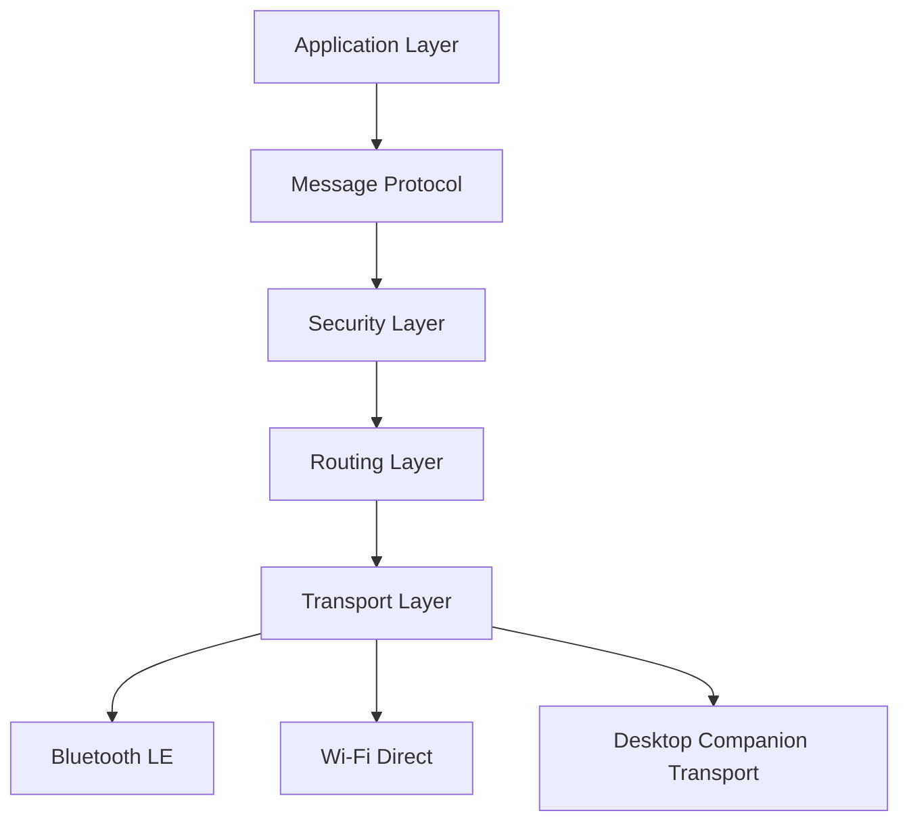
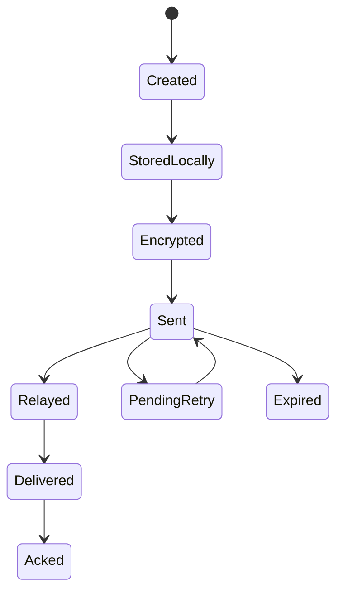
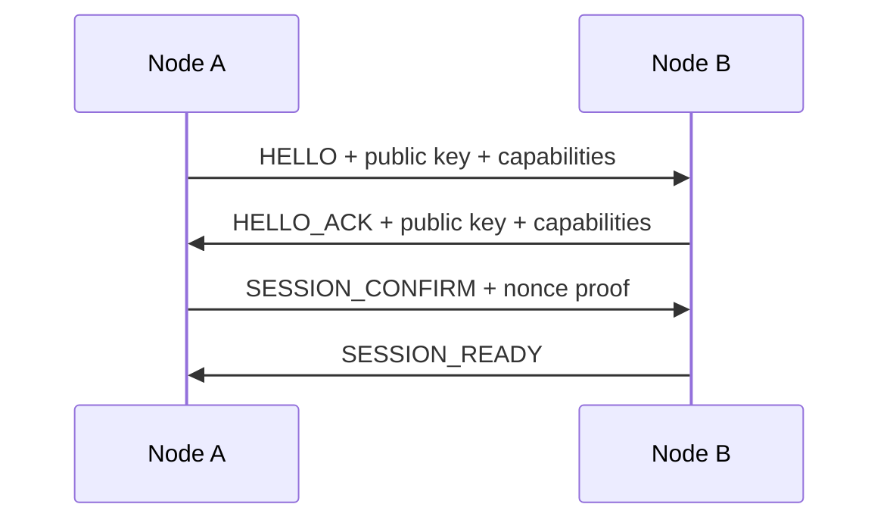
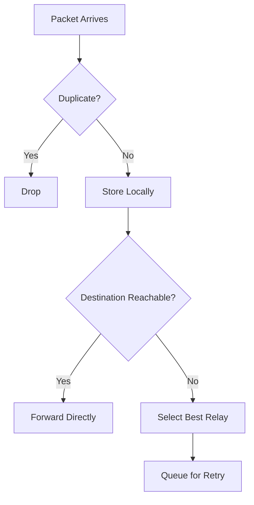
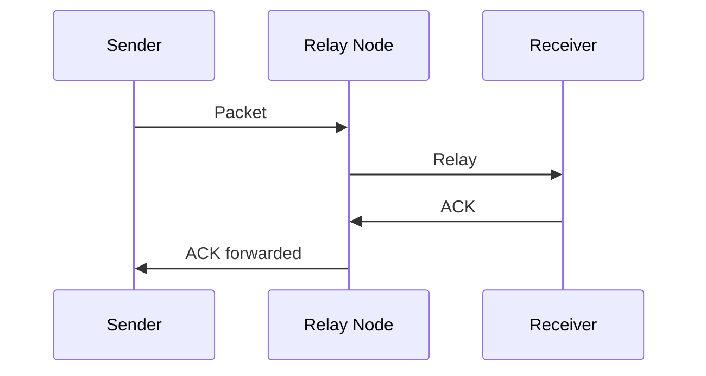

# AstraMesh Protocol

## 1. Purpose

This document defines the wire protocol, packet structure, message lifecycle, handshake flow, relay rules, and delivery semantics for AstraMesh.

The protocol is designed for:

- Android phone-to-phone communication
- optional PC / laptop companion nodes
- Bluetooth Low Energy as the primary transport
- optional Wi-Fi Direct or local fallback transport
- encrypted end-to-end messaging
- store-and-forward delivery
- file transfer in chunks
- emergency broadcast messages
- GitHub-hosted source code and CI-friendly builds

The protocol must be stable, versioned, easy to serialize, and safe for relay across multiple hops.

---

## 2. Protocol Design Goals

1. **Offline-first**  
   No internet or central server is required for core messaging.

2. **Peer-to-peer**  
   Every node can send, receive, and relay packets.

3. **Encrypted by default**  
   All user content must be encrypted before transmission.

4. **Versioned**  
   Every packet must include a protocol version so future changes remain compatible.

5. **Deduplicated**  
   The same packet must not circulate forever.

6. **Reliable**  
   Packets should survive temporary disconnects through store-and-forward.

7. **Transport-agnostic**  
   The packet format should work over BLE, GATT, Wi-Fi Direct, or other supported local transports.

---

## 3. Protocol Stack Overview



### Layer responsibilities

#### Application Layer
- chat UI
- file sharing UI
- broadcast UI
- diagnostics UI

#### Message Protocol
- packet types
- versioning
- serialization
- acknowledgments

#### Security Layer
- handshake
- key exchange
- encryption
- signatures

#### Routing Layer
- relay selection
- deduplication
- retry logic
- TTL enforcement

#### Transport Layer
- BLE send/receive
- optional fallback transports
- fragmentation and reassembly

---

## 4. Versioning Strategy

Every packet must include:

- `protocolVersion`
- `packetVersion`
- `appVersion` where useful

### Why versioning matters
- older apps can reject unsupported packets safely
- future protocol changes can be introduced gradually
- debugging becomes easier
- CI and GitHub releases can tag compatibility clearly

### Recommended version format
- semantic versioning: `1.0.0`
- packet schema version: `1`
- transport capabilities version: `1`

---

## 5. Node Identity Model

Every device in AstraMesh has a local identity.

### Identity fields
- `nodeId`
- `deviceName`
- `platformType`
- `publicKey`
- `keyFingerprint`
- `capabilities`
- `lastSeen`

### Identity rules
- node identity is generated locally
- the user does not need an online account
- identity should persist across app restarts
- identity should remain private unless intentionally shared

---

## 6. Capability Exchange

During discovery and handshake, nodes exchange capability information.

### Capability payload
```json
{
  "nodeId": "uuid",
  "deviceName": "AstraMesh Node",
  "platformType": "android",
  "protocolVersion": "1.0.0",
  "capabilities": ["chat", "relay", "broadcast", "file-transfer"],
  "relayCapacity": "normal",
  "supportsDesktopView": false
}
```

### Why capability exchange is required
- to know whether a node can relay
- to know whether the peer supports file transfer
- to know whether desktop companion behavior is available
- to detect incompatible protocol versions early

---

## 7. Transport Abstraction Contract

The protocol must not depend on one transport only.

### Supported transport classes
- BLE advertisement + scan response
- BLE GATT sessions
- Wi-Fi Direct where available
- local desktop companion transport

### Transport contract
Every transport backend must support:
- connect
- send packet
- receive packet
- acknowledge receipt
- disconnect
- reconnect
- report health

### Transport rule
The routing layer only talks to the abstract transport interface, not directly to device-specific APIs.

---

## 8. Packet Envelope

All packets share a common envelope.

### Base packet schema
```json
{
  "protocolVersion": "1.0.0",
  "packetVersion": 1,
  "packetId": "uuid",
  "type": "chat",
  "senderId": "node-a",
  "receiverId": "node-b",
  "timestamp": 1234567890,
  "ttl": 10,
  "hopCount": 0,
  "priority": "normal",
  "payload": "base64-or-json",
  "signature": "optional",
  "checksum": "optional"
}
```

### Envelope fields
- `protocolVersion`: top-level protocol compatibility
- `packetVersion`: schema version for the specific packet format
- `packetId`: unique identifier
- `type`: packet category
- `senderId`: origin node
- `receiverId`: intended destination or broadcast target
- `timestamp`: send time
- `ttl`: maximum lifetime or hops
- `hopCount`: number of relays traversed
- `priority`: routing priority
- `payload`: encrypted content
- `signature`: authenticity check if used
- `checksum`: integrity validation

---

## 9. Packet Types

### 9.1 Presence Packet
Used to announce that a node is nearby.

Fields:
- node identity
- capability summary
- link health

### 9.2 Handshake Packet
Used to establish a secure session.

Fields:
- public key material
- nonce
- protocol version
- session negotiation data

### 9.3 Chat Packet
Used for one-to-one or one-to-few chat messages.

Fields:
- message text
- optional reactions
- optional reply metadata

### 9.4 Broadcast Packet
Used for emergency or community-wide announcements.

Fields:
- broadcast text
- severity
- target scope
- expiry time

### 9.5 File Chunk Packet
Used to transfer files in chunks.

Fields:
- fileId
- chunkIndex
- totalChunks
- chunkData
- fileHash

### 9.6 ACK Packet
Used to confirm receipt or delivery.

Fields:
- acknowledgedPacketId
- status
- receiver node
- timestamp

### 9.7 Routing Summary Packet
Used to share knowledge about pending and known messages.

Fields:
- knownPacketIds
- queuedPacketIds
- recent peers
- delivery hints

### 9.8 Health Packet
Used for diagnostics and relay health.

Fields:
- battery level if allowed
- queue length
- storage pressure
- transport status

---

## 10. Message Lifecycle



### Lifecycle rules
- messages are stored before leaving the sender
- encrypted content is never transmitted in plaintext
- packets can be retried after temporary failure
- packets expire after TTL or policy limit
- successful delivery produces an ACK

---

## 11. Handshake Protocol

A secure session must be established before content exchange.

### Handshake sequence


### Handshake goals
- verify protocol compatibility
- exchange public keys
- establish trust material
- confirm transport readiness
- enable encrypted packet exchange

### Handshake failure cases
- version mismatch
- unsupported capability
- timeout
- signature failure
- corrupted payload

---

## 12. Encryption Protocol

### Security principles
- encrypt before transmission
- decrypt only on the recipient device
- relay nodes should not read content
- local keys must remain on device
- signatures may be used for integrity and authenticity

### Encryption workflow
1. peers exchange public key material
2. derive a session key
3. encrypt payload with authenticated encryption
4. send packet over transport
5. receiver decrypts and verifies
6. receiver sends ACK

### Payload policy
- sensitive content must never be sent in plaintext
- metadata should be minimized where possible
- public routing fields may remain visible to enable forwarding

---

## 13. Routing Semantics

### Routing model
AstraMesh uses local relay logic instead of a global central router.

### Routing strategies
- epidemic relay for broad reach
- store-and-forward for offline recipients
- deduplication cache for repeated packets
- TTL enforcement to prevent endless circulation
- priority queue for urgent packets

### Routing decision flow


### Relay selection inputs
- peer availability
- peer capability
- link quality
- current queue size
- message priority
- hop count remaining

---

## 14. Deduplication Protocol

Because relay networks can create duplicates, deduplication is essential.

### Deduplication rules
- every packet has a unique `packetId`
- every node stores a seen-ID cache
- duplicate packet IDs are dropped
- a packet should not be reprocessed once accepted

### Dedup cache strategy
- store packet IDs for a limited retention window
- expire old IDs after policy limit
- keep cache size bounded for memory safety

---

## 15. Store-and-Forward Protocol

### When to store
- receiver is offline
- route is unknown
- link is weak or unstable
- user explicitly marks a message for later delivery

### When to retry
- a new peer appears
- a better route becomes available
- the app reconnects to the destination

### Retry rules
- retry count should be bounded
- TTL must still apply
- message priority can influence retry order

---

## 16. Acknowledgment Protocol

ACKs confirm receipt or delivery.

### ACK contents
- acknowledged packet ID
- status: received / delivered / failed
- timestamp
- receiver node ID

### ACK flow


### ACK rules
- ACKs should be lightweight
- ACKs should also be deduplicated
- ACKs can be relayed through the same mesh

---

## 17. File Transfer Protocol

Files are split into chunks to fit local transport limits.

### File chunk fields
- fileId
- chunkIndex
- totalChunks
- chunkHash
- fileHash
- chunkData

### File protocol flow
1. sender creates metadata packet
2. file is chunked
3. each chunk is encrypted
4. chunks are sent through the mesh
5. receiver reassembles chunks
6. receiver verifies file hash
7. receiver stores file locally

### File rules
- chunks may arrive out of order
- missing chunks should be retried
- file transfer completion requires all chunks
- integrity verification is mandatory

---

## 18. Broadcast Protocol

Broadcast packets are used for emergency announcements and community updates.

### Broadcast rules
- broadcast packets are relayed broadly
- broadcasts have higher priority than normal messages
- duplicates must still be prevented
- broadcasts should remain visible in a dedicated UI area

### Broadcast scopes
- local nearby only
- area relay only
- all reachable peers

---

## 19. Desktop / PC Companion Protocol

PC support is optional but follows the same packet rules.

### PC companion behavior
- receive packets like a normal node
- display messages on a larger screen
- optionally act as a relay hub
- optionally store packet history for longer periods

### PC rule
A desktop node must never be required for core phone-to-phone messaging.

---

## 20. Local Storage Mapping

### Suggested local tables
- `nodes`
- `sessions`
- `messages`
- `message_acks`
- `packet_cache`
- `file_transfers`
- `file_chunks`
- `broadcasts`
- `routing_events`

### Storage rules
- store first, then send
- persist all important states
- keep queues recoverable after restart

---

## 21. Error Handling Protocol

### Expected failures
- packet corruption
- link disconnect
- timeout
- version mismatch
- duplicate reception
- storage full

### Recovery behavior
- retry where possible
- drop duplicates safely
- mark packets failed after bounded retries
- keep UI and storage synchronized

---

## 22. GitHub and CI Expectations

The repository should be organized so GitHub Actions can build it without manual steps.

### CI should validate
- Gradle sync
- unit tests
- protocol serialization tests
- routing logic tests
- APK build
- desktop module build if enabled
- website build if included

### Recommended GitHub workflow outputs
- debug APK artifact
- test reports
- build logs
- optional website artifacts

---

## 23. Testing Protocol

### Minimum test types
- packet serialization tests
- encryption/decryption tests
- deduplication tests
- relay routing tests
- store-and-forward tests
- ACK flow tests
- file chunk assembly tests

### Integration tests should verify
- two phones can discover each other
- a relay node can forward packets
- a delayed node can receive pending messages later
- desktop companion can show received messages

---

## 24. Compatibility Rules

### A packet should be accepted only if
- protocol version is supported
- packet schema version is recognized
- signature or integrity check passes
- packet ID is not already processed
- TTL is not expired

### A packet should be rejected if
- it is malformed
- it uses unsupported protocol version
- it fails verification
- it has expired

---

## 25. Implementation Priorities

### MVP priority
1. discovery packet
2. handshake packet
3. chat packet
4. ACK packet
5. deduplication
6. store-and-forward
7. file chunk packet
8. broadcast packet
9. desktop companion packet handling

### Future priority
- trust scoring
- richer routing heuristics
- CRDT sync
- better Wi-Fi Direct fallback
- offline map and coordination packets

---

## 26. Protocol Summary

AstraMesh uses a versioned encrypted packet protocol over local peer-to-peer transport. Devices discover each other, handshake securely, send small packets, relay them across hops, deduplicate repeated packets, store pending packets locally, and confirm receipt through ACKs. GitHub-hosted source code and CI keep the entire implementation reproducible and buildable from scratch.

