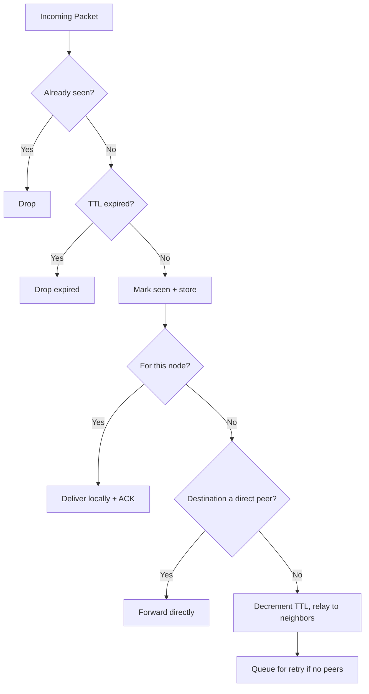

# AstraMesh Routing

> Companion to [`protocol.md`](protocol.md). This document isolates the routing/relay
> algorithm so it can evolve independently of the wire format. The routing engine lives in
> the pure-Kotlin `core-routing` module and has **no** Android or transport dependencies.

## 1. Goal

Move packets to the best available next hop and preserve them until delivery or expiry, using
only local knowledge. There is no global router and no central coordinator.

## 2. MVP Strategy

AstraMesh MVP uses **epidemic (flooding) relay** with the following controls:

- **Deduplication** — every packet has a unique `packetId`; a bounded seen-cache drops repeats.
- **TTL + hop count** — packets expire after `ttl` hops or a time budget, preventing loops.
- **Store-and-forward** — undeliverable packets persist and retry on new peer contact.
- **ACK tracking** — delivery is confirmed by lightweight, deduplicated ACK packets.
- **Priority ordering** — emergency broadcasts jump ahead of normal chat and file chunks.

## 3. Decision Flow

## 4. Relay Decision Inputs

- peer availability and link quality
- peer capability (must advertise `relay`)
- current queue size / storage pressure
- message priority
- remaining TTL / hop count

## 5. Priority Ordering

1. emergency broadcasts
2. direct chat
3. file chunks
4. background sync (routing summaries, health)

## 6. Store-and-Forward

A packet is stored for later when: the receiver is offline, no route is known, the link is weak,
or the user marked it for later. It is retried when a new peer appears or a better route opens,
bounded by a max retry count and the packet's TTL.

## 7. Deduplication Cache

- bounded, time-windowed set of seen `packetId`s
- old IDs expire after a retention window to bound memory
- ACKs are deduplicated the same way

## 8. Testing

`core-routing` ships JVM unit tests for: dedup drop, TTL/hop expiry, direct-vs-relay decisions,
store-and-forward retry ordering, and ACK forwarding. See [`protocol.md`](protocol.md) §23.

## 9. Future Upgrades

Encounter-based routing, trust-aware routing, priority emergency routing, and CRDT-based shared
state sync (see [`idea.md`](idea.md) §12).
