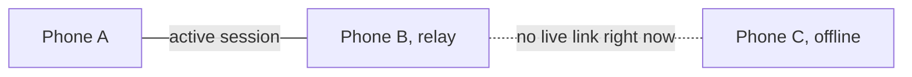
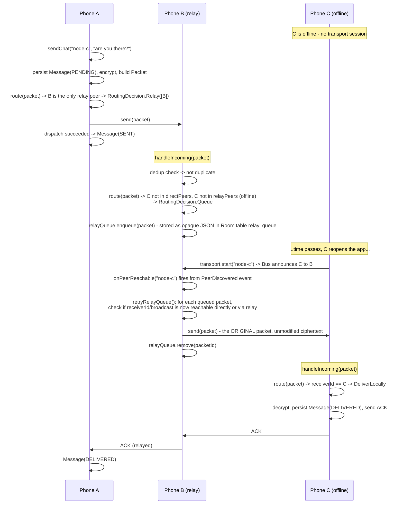
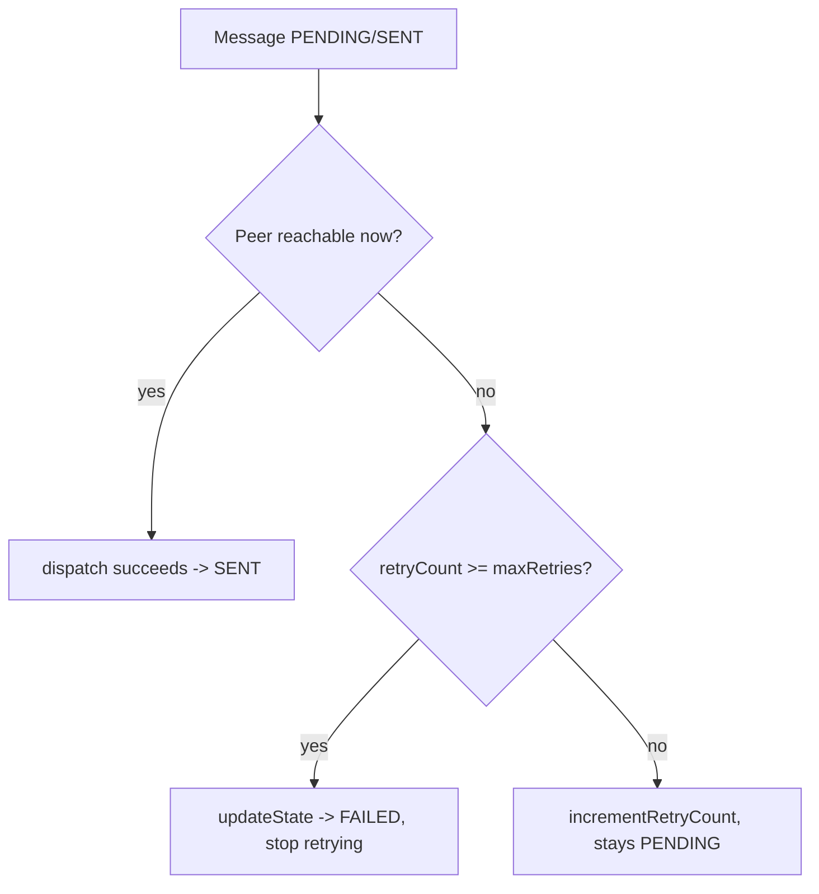

# Demo: Store-and-Forward (Phone C offline, A sends, B stores, C returns)

Companion to [`workflow.md`](workflow.md) §9 and [`routing.md`](routing.md) §6. Walks through
what happens when the destination (or a needed relay) is temporarily unreachable, and how the
message survives that outage and is delivered once the route reappears. Verified by
`MeshCoordinatorTest.storeAndForward_relayQueuesForOfflinePeer_thenDeliversOnReturn` and
`MeshCoordinatorTest.pendingMessage_marksFailed_afterExceedingRetryBudget`.

## 1. Two independent retry queues

AstraMesh has two separate store-and-forward paths, because they hold different kinds of data
with different ownership:

| Queue | Holds | Owner | Repository |
|---|---|---|---|
| **Message retry queue** | This node's own outgoing messages that haven't been ACKed yet | The sender | `MessageRepository.pending()` (Room table `messages`, states `PENDING`/`SENT`/`RELAYED`) |
| **Relay queue** | Other nodes' packets this node is carrying but has no route for | An intermediate relay | `RelayQueueRepository` (Room table `relay_queue`) — stores the packet **still encrypted**, since a relay can never decrypt it anyway |

Both are drained by the same trigger: `MeshCoordinator.onPeerReachable`, called whenever the
transport reports a `TransportEvent.PeerDiscovered` (a peer becoming reachable again).

## 2. Scenario topology

A's only path to C is through B. C is temporarily offline (app closed, out of range, etc).

## 3. Sequence

## 4. Why retrying does not re-run the dedup/TTL decision

A subtlety worth calling out explicitly: `retryRelayQueue()` does **not** call
`RoutingEngine.route()` again on the queued packet. The first time B saw that `packetId`, the
dedup cache already marked it seen (that's *why* B was allowed to decide to queue it instead of
dropping it as a duplicate). Calling `route()` again on retry would hit the same dedup cache
and every retry would be wrongly classified `Drop(DUPLICATE)`. Instead, retry is a pure
**transport-reachability** re-check: has a direct or relay path to the packet's destination
appeared since it was queued? The routing *decision* (relay vs. deliver, TTL budget) was
already made and doesn't need to be re-litigated — only "can I forward this now" does.

## 5. ACK propagation back through the same relay

Delivery confirmation is not a special case — an ACK is itself a `Packet` (type `ACK`,
encrypted, addressed back to the original sender) that goes through the exact same
routing/relay/store-and-forward pipeline. If B were to go offline between forwarding the CHAT
and receiving the ACK, the ACK would itself queue in B's relay queue and retry on B's next
contact with A — the mechanism is symmetric.

## 6. Retry budget and FAILED state

Store-and-forward is not unbounded. `MeshCoordinator(maxRetries = 5)` (default) bounds how many
times a node will keep retrying its **own** pending messages before giving up:

The relay queue (other nodes' packets) does not use this counter today — a queued relay packet
is retried whenever its destination becomes reachable, bounded only by the packet's own TTL
(`packet.isExpired` is checked on every retry pass and expired packets are dropped from the
queue). This matches `docs/routing.md` §6: "bounded by a max retry count and the packet's TTL."

## 7. Verification checklist (matches the milestone spec)

| Requirement | How it's verified |
|---|---|
| Queue persistence | `RelayQueueRepository`/`RoomRelayQueueRepository` — packets are stored in the Room `relay_queue` table (JSON-encoded `Packet`, still encrypted), not just an in-memory list |
| Retry logic | `MeshCoordinator.retryRelayQueue()` / `retryPendingMessages()`, triggered on `TransportEvent.PeerDiscovered` |
| ACK propagation | ACKs are ordinary packets and flow through the same relay/queue pipeline (§5 above) |
| App restart resilience | `RelayQueueEntity`/`MessageEntity` are Room-persisted (SQLite-backed), so a queued or pending message survives a process restart — same pattern verified for messages in `restart_messagesPersistAndMessagingContinues` |
| C offline, A sends, B stores, C returns, message delivered | `storeAndForward_relayQueuesForOfflinePeer_thenDeliversOnReturn` |
