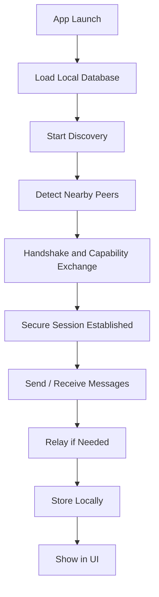
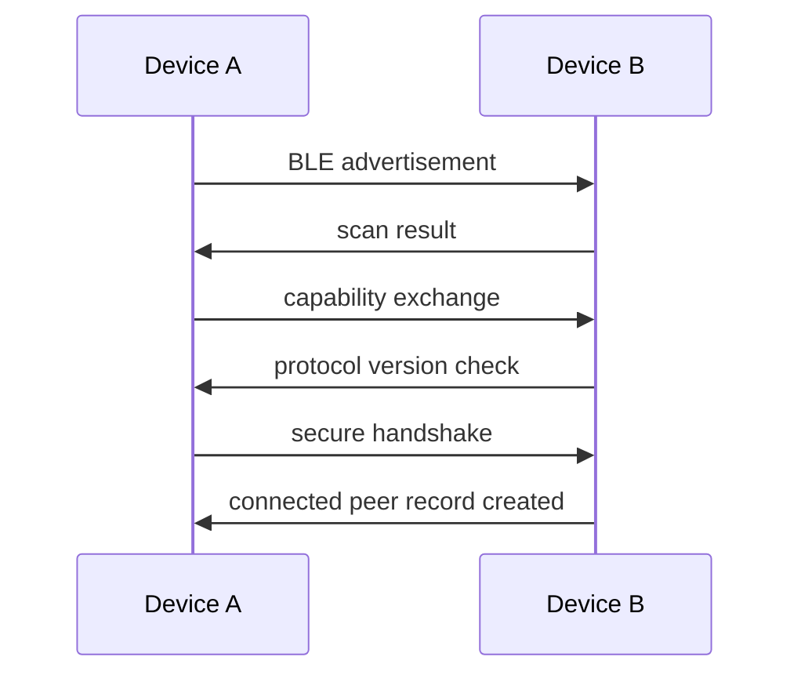
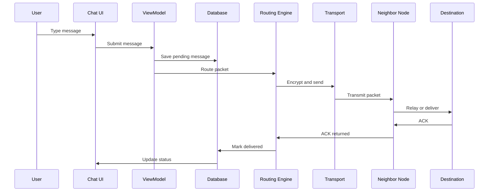
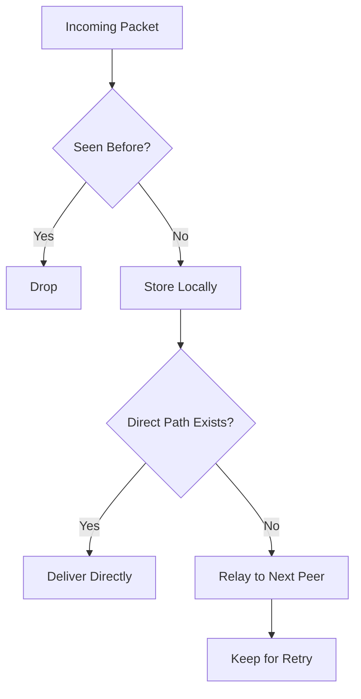
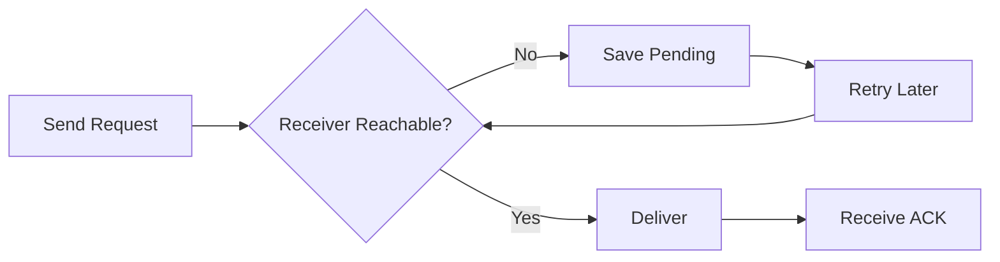
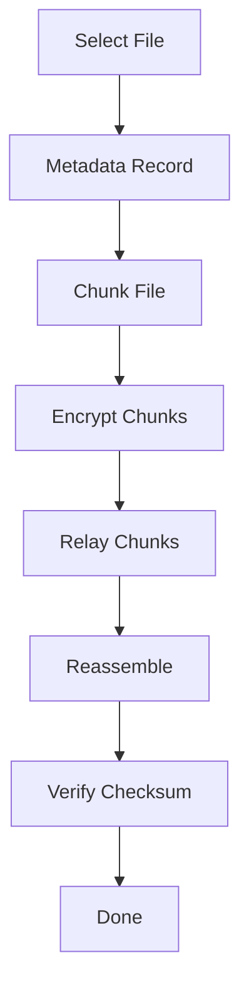
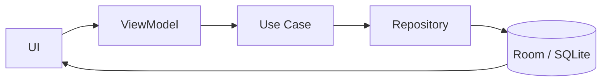
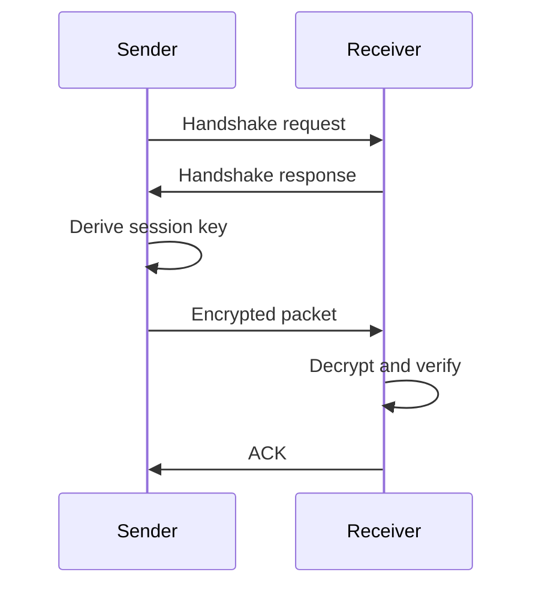
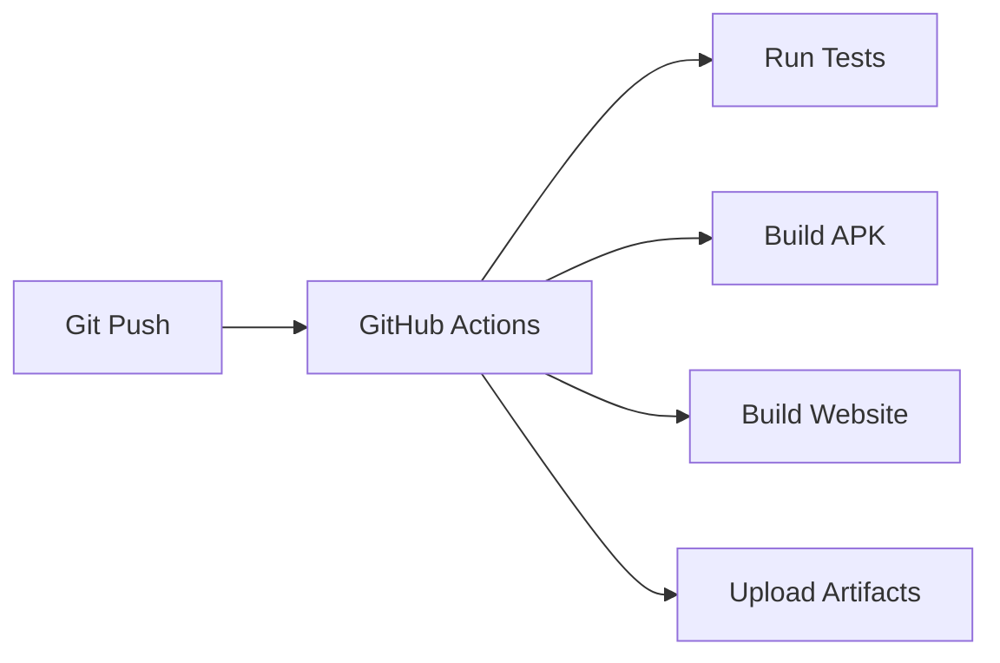

# AstraMesh Workflow

## 1. Purpose

This document explains the complete working flow of AstraMesh from installation to discovery, messaging, relay, storage, desktop viewing, and demo execution.

The workflow is written so Claude Code or any developer agent can follow it and generate a fully working project from scratch.

---

## 2. Core Workflow Principle

The system must work like this:

1. install the app
2. open the app on Android phones
3. discover nearby peers over Bluetooth
4. exchange encrypted packets
5. relay messages through intermediate devices
6. store everything locally in SQLite / Room
7. optionally mirror or show messages on a PC companion
8. present the result in a website and demo

---

## 3. Runtime Workflow Overview



---

## 4. App Launch Workflow

When the app starts:

1. load cached peers
2. load pending messages
3. initialize database
4. start Bluetooth scanning
5. advertise presence
6. update UI with local state

### Launch rule
The app should not depend on a remote server during startup.

---

## 5. Peer Discovery Workflow

### Discovery flow



### Discovery steps
- scan for nearby devices
- advertise node presence
- exchange node capability data
- verify protocol compatibility
- create a local peer record
- mark peer as active or relay-capable

### Discovery output
- peer appears in nearby list
- signal quality shown
- transport support shown
- relaying support shown

---

## 6. Connection Workflow

After discovery, the app attempts a session.

### Connection steps
1. choose a compatible peer
2. exchange public metadata
3. derive session keys
4. mark session as secure
5. enable packet exchange

### Session status
- discovered
- handshaking
- secure
- active
- interrupted
- retrying
- closed

---

## 7. Messaging Workflow

### Normal chat flow



### Messaging steps
- user composes message
- message is stored locally first
- packet is encrypted
- routing engine decides direct or relay path
- transport layer sends packet
- receiver decrypts and stores it
- delivery confirmation travels back
- UI updates status

### Message states
- draft
- pending
- sent
- relayed
- delivered
- failed
- expired

---

## 8. Relay Workflow

Relay is what makes the system a mesh.

### Relay steps
1. receive packet from neighbor
2. check deduplication cache
3. drop duplicates
4. store packet locally
5. evaluate destination reachability
6. forward directly if reachable
7. otherwise forward to best relay neighbor
8. keep packet for retry if needed

### Relay flow



### Relay rules
- do not flood forever
- do not re-forward duplicates
- respect TTL
- preserve encrypted payload
- store before forwarding when needed

---

## 9. Store-and-Forward Workflow

If the receiver is offline:

1. store the packet locally
2. mark it pending
3. wait for future peer contact
4. retry delivery later
5. expire it if TTL or time limit ends



This is critical for disaster and low-connectivity scenarios.

---

## 10. File Sharing Workflow

### File transfer steps
1. select a file
2. generate metadata record
3. chunk the file
4. encrypt each chunk
5. send chunks through the relay network
6. reassemble on destination
7. verify integrity
8. mark transfer complete

### File flow



### Supported file types
- images
- text
- PDFs
- small documents

---

## 11. Emergency Broadcast Workflow

Broadcasts are high-priority and should be handled faster than ordinary messages.

### Broadcast steps
1. user writes emergency alert
2. packet is marked high priority
3. broadcast is sent to all nearby peers
4. peers relay the alert
5. alert is displayed in special UI
6. broadcast history is saved locally

### Broadcast behavior
- aggressive forwarding
- strong deduplication
- visible delivery status
- local storage for later inspection

---

## 12. PC / Desktop Workflow

PC support is optional but useful for demo and visibility.

### Desktop can do
- show incoming messages
- store relayed packets
- act as a larger relay hub
- display diagnostics and network health
- help with a polished demo presentation

### Desktop workflow
1. launch companion app
2. scan for nearby phone peers
3. join the same mesh session
4. receive and display messages
5. optionally relay packets further
6. keep local logs and archives

### Why desktop is useful in demo
- easier to see received messages
- easier to present state on a big screen
- more stable as a long-running relay
- good for judges to understand the network visually

---

## 13. Database Workflow

The database is the source of truth.

### Stored entities
- peers
- sessions
- pending packets
- delivered packets
- failed packets
- broadcast records
- file metadata
- relay history

### Database flow



### Storage rule
Never trust transient in-memory state alone. Persist first, then send.

---

## 14. Security Workflow

### Security steps
1. handshake
2. key exchange
3. session derivation
4. encrypted packet send
5. encrypted packet receive
6. verification and ACK



### Security rules
- no plaintext relay
- no login required
- no cloud dependency
- local keys only

---

## 15. UI Workflow

### Main screens
- onboarding / permissions
- nearby peers
- chat
- file transfer
- broadcasts
- pending queue
- diagnostics
- settings

### UI behavior
- show peers discovered
- show delivery states
- show relay hops if useful
- show pending packets
- show file progress
- show desktop companion status when present

---

## 16. Website Workflow

The website is a separate folder and should not mix with app logic.

### Website folder
```text
web/
```

### Website flow
1. read product pitch
2. show features
3. show screenshots
4. show architecture summary
5. show demo section
6. show install or contact link

### Website goal
The website should make the project easy to understand quickly for judges and reviewers.

---

## 17. GitHub Workflow

### Repository workflow
- docs first
- architecture second
- workflow third
- protocol and routing next
- app implementation after that
- test suite next
- GitHub Actions last
- screenshots and README polish at the end

### CI workflow



### CI checks
- compile Android app
- compile optional desktop module
- build website
- run unit tests
- upload APK and website build artifacts

---

## 18. Demo Workflow

### Demo must show
- discovery
- chat delivery
- relay through another device
- store-and-forward delivery
- file sharing
- emergency broadcast
- optional desktop message display

### Demo sequence
1. open app on two or three phones
2. show peer discovery
3. send a message through a relay node
4. turn off one node and show pending delivery
5. bring node back and show message arrival
6. send a file
7. send a broadcast
8. show desktop companion if available
9. mention that everything runs without internet

---

## 19. End-to-End Acceptance Workflow

The project is ready only if the following all work:

- phone discovers phone
- peer session opens
- message is encrypted
- message is relayed
- message is stored locally
- message is delivered later if needed
- file chunking works
- broadcasts work
- desktop companion can show received messages
- website explains the project clearly
- GitHub Actions build passes

---

## 20. Final Workflow Summary

AstraMesh works by discovering nearby phones over Bluetooth, establishing secure sessions, storing messages locally, relaying packets hop by hop, optionally mirroring behavior to a desktop companion, and presenting the project clearly through a promotional website and automated GitHub builds.
